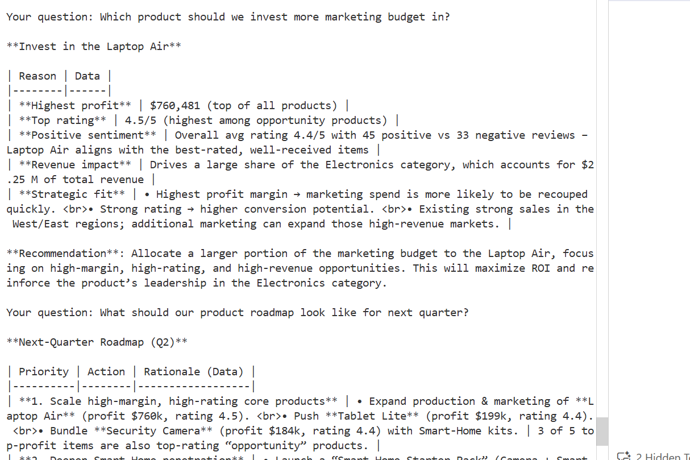

# AI-Powered Product Strategy Assistant (Minimal Implementation)

This simple Python application demonstrates a minimal multi-agent product strategy assistant using the sample sales dataset.

## Files

- `app.py`: CLI entry point and simple interactive question flow.
- `agents.py`: three lightweight agents for data analysis, feedback analysis, and strategy recommendations.
- `Sample Sales Data.csv`: input dataset already present in the workspace.

## How to run

1. Open a terminal in the project folder.
2. Run:

```bash
python app.py
```

3. Ask questions such as:

- `top products`
- `region summary`
- `feedback sentiment`
- `recommendations`
- `report`
- `exit`

## Notes

- This implementation uses only Python standard library modules.
- The `agents.py` file contains a minimal multi-agent architecture.
- The app provides a simple interactive experience and generates a summary report.


